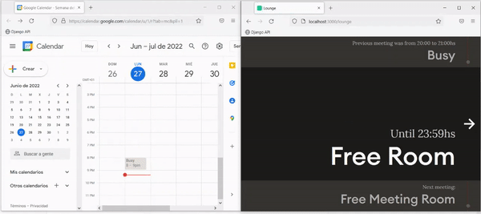

# Meeting Room Display with RGB ##

This is a standard Node.js project, just run `npm ci` to install the dependencies and `npm run dev` to start development mode with live reload. Run `npm run build` and then `npm start` to run the app in production mode.

## Materials

- 1 x Raspberry Pi 4GB [Link to Pimoroni](https://shop.pimoroni.com/products/raspberry-pi-4-essentials-kit?variant=39850460119123)
- 1 x Wall Mount Bracket [Link to Amazon](https://www.amazon.co.uk/dp/B07PDG7PRL/ref=sspa_dk_detail_4?psc=1p13NParams&smid=A3G1GPKDFEJLJM&spLa=ZW5jcnlwdGVkUXVhbGlmaWVyPUEyNEI1RDdWNlZaNjJRJmVuY3J5cHRlZElkPUEwMTY2ODM5MkhEMEMzU01OUVk3RiZlbmNyeXB0ZWRBZElkPUEwNjM4MTE3M0dXOVZKWlZVNVlJWSZ3aWRnZXROYW1lPXNwX2RldGFpbDImYWN0aW9uPWNsaWNrUmVkaXJlY3QmZG9Ob3RMb2dDbGljaz10cnVl)
- 1 x Portable Monitor 15.6 inch. [Link to Amazon](https://www.amazon.co.uk/Pisichen-Portable-1920x1080-Compatible-Raspberry/dp/B08T7F69R1/ref=sr_1_6?keywords=15.6+inch+screen&qid=1636294649&qsid=260-5128270-6527226&sr=8-6&sres=B08B3N99S6%2CB00FE690DI%2CB08B5F3721%2CB08T7F69R1%2CB08CXQ8Z5F%2CB07GST9YD8%2CB01F5OHLAM%2CB088FHSWJL%2CB096FG33NX%2CB07ZLY26FW%2CB071S84ZW7%2CB0924L6HQX%2CB01H76JM2G%2CB08MVQMH37%2CB01J5VTP0A%2CB07N8XG947&srpt=MONITOR)

## Setup & Config - Raspberry Pi configuration

We need to configure the Raspberry Pi in Kiosk Mode. 

1) Open Terminal in Raspberry Pi (Update and Upgrade)

    sudo apt update
    sudo apt install rpi-update

2) Launch chromium in kiosk mode 
2.1)  sudo  Path /home/pi/.config/lxsession/LXDE-pi/autostart or sudo nano /etc/xdg/lxsession/LXDE-pi/autostart

   
Copy the details below :   
  
    @lxpanel --profile LXDE-pi
    @pcmanfm --desktop --profile LXDE-pi
    @xscreensaver -no-splash
    @point-rpi

    @xset s off  # Disabled screensaver
    @xset /dpms   # Disabled DPMS 
    @xset s noblank # Dont blank the video device
    @chromium-browser --noerrors --disable-session-crashed-bubble --disable-infobars --kiosk --incognito http://localhost:3000/lounge    #If page is open in incognito mode cache is ignored

## Setup & Config - NodeJs

Before run the commands, we need to create 2 files inside the api folder; rooms-client.json and rooms.json

### rooms-client.json

Go to the [Google Developer Console](https://console.developers.google.com/) and create a new Project.

### rooms.json
Structure is as below. 

    {
    "lounge": {"name": "Lounge", "slug": "lounge", "position": "right", "id": "this_is_your_api_calendar_email@group.calendar.google.com"}
    }

1) Go to folder usr/local then git clone project
1) sudo apt-get install -y nodejs
1) sudo npm install
2) We use Pm2 to run nodejs in the background ->  npm install PM2@latest -g
3) pm2 start server.js 
4) pm2 startup
5) pm2 startup systemd 

## Setup & Config - NodeRed

Install NodeRed
1) Go to folder nodered in this project and change format to json then upload file to nodered
2) Start Nodered as autostart:   
  
    sudo systemctl enable nodered.service

Http path to turn on red light is localhost:1880/red and green light is localhost:1880/green

